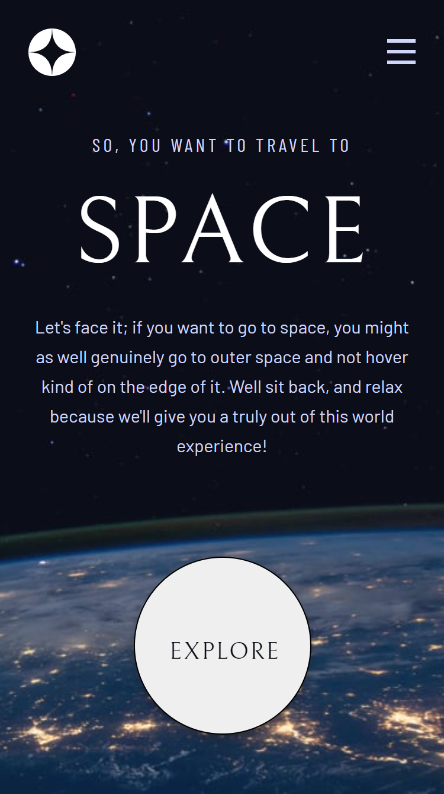

# Frontend Mentor - Space tourism website solution

This is a solution to the [Space tourism website challenge on Frontend Mentor](https://www.frontendmentor.io/challenges/space-tourism-multipage-website-gRWj1URZ3). Frontend Mentor challenges help you improve your coding skills by building realistic projects. 

## Table of contents

- [Overview](#overview)
  - [The challenge](#the-challenge)
  - [Screenshot](#screenshot)
  - [Links](#links)
- [My process](#my-process)
  - [Built with](#built-with)
  - [What I learned](#what-i-learned)
  - [Continued development](#continued-development)
  - [Useful resources](#useful-resources)
- [Author](#author)
- [Acknowledgments](#acknowledgments)

## Overview

### The challenge

Users should be able to:

- View the optimal layout for each of the website's pages depending on their device's screen size
- See hover states for all interactive elements on the page
- View each page and be able to toggle between the tabs to see new information

### Screenshot

### Links

- Solution URL: [GitHub](https://github.com/Kwill3/sbasex)
- Live Site URL: [GitHub Pages](https://kwill3.github.io/sbasex/)

## My process

### Built with

- Semantic HTML5 markup
- CSS / SASS
- Flexbox
- CSS Grid
- Mobile-first workflow
- Responsive Web Design
- Javascript
- [React](https://reactjs.org/) - JS library
- React Hooks for state
- React Router for navigation

### What I learned

- React Router to serve the different pages when clicked from the Navigation Bar.

- Different ways to add hover functionality, especially NavLink and active class.

- Using React Hooks to render different pages according to data.json file.

- Using multiple classes on an element to set it as the default element.

### Useful resources

- [React Router Tutorial](https://reactrouterdotcom.fly.dev/docs/en/v6/getting-started/tutorial) - This documentation explains how to implement React Router v6.
- [React Hooks useState](https://www.youtube.com/watch?v=O6P86uwfdR0) - This video sums up the useState functionality in React Hooks neatly, it was very easy for me to understand and start using right away.

## Author

- GitHub - [William Lee](https://github.com/Kwill3)

## Acknowledgments

- [Web Dev Simplified Youtube Channel](https://www.youtube.com/c/WebDevSimplified) - This channel helped me immensely while I was working on this project, a lot of the videos helped me when I got stuck with a particular function that I was trying to implement.
